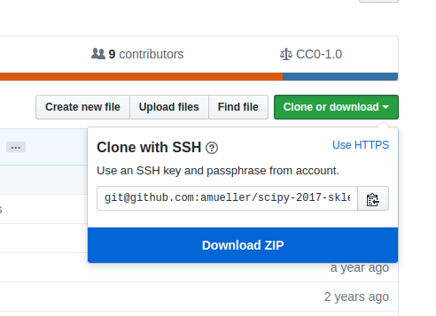
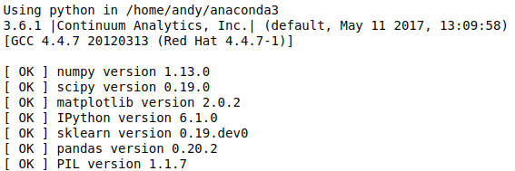

AWS LTA Workshop 2020
================================


Instructors
-----------

- [Daniel Kurniadi](https://www.linkedin.com/in/danielkur/)  [@iqDF](https://github.com/iqDF) - Singapore, Nanyang Technological University
---


This repository will contain the teaching material and other info associated with our AWS LTA data science workshop
at [AWS LTA 2020](https://github.com/MLDA-NTU) held January 2020 in NTU, Singapore.

### Schedule:

The 2-part tutorial will be held every week during the event:

- Parts 1: Wednesday, January 21, 2020 (time 18:00 SGT) 
- Parts 2: Wednesday, January 28, 2020 (time 18:00 SGT)


Obtaining the Tutorial Material
------------------


If you have a GitHub account, it is probably most convenient if you clone or
fork the GitHub repository. You can clone the repository by running:

```bash
git clone --recursive https://github.com/MLDA-NTU/AWS-Workshop-2020.git

```

 If you are not familiar with git or don’t have an
GitHub account, you can download the repository as a .zip file by heading over
to the GitHub repository (https://github.com/MLDA-NTU/AWS-Workshop-2020) in
your browser and click the green “Download” button in the upper right.



Please note that we may add and improve the material until shortly before the
tutorial session, and we recommend you to update your copy of the materials one
day before the tutorials. If you have an GitHub account and cloned the
repository via GitHub, you can sync your existing local repository with:

```bash
    $ git pull origin master
```

If you don’t have a GitHub account, you may have to re-download the .zip
archive from GitHub.

Running in Google Colab
------------------
The recommended way to follow our workshop and run our notebooks is using [Google Colab here](https://colab.research.google.com/). Follow the instruction as follows:

#### Step 1:
Open the menu `File` on the top left bar in Google Colab notebooks and choose menu `Open Notebook ...`.

#### Step 2:
An orange menu box will pop out for you to choose a notebook to open from. Here, we can open the workshop notebook straight from our Github repository. 

Installation Notes on Local Machine
------------------
If you decided to run the workshop notebooks on your local machine, you need to first install [Python3.5+](https://www.python.org/downloads/) from the official site [here](https://www.python.org/downloads/).

This tutorial will require recent installations of

- [NumPy](http://www.numpy.org)
- [SciPy](http://www.scipy.org)
- [matplotlib](http://matplotlib.org)
- [pandas](http://pandas.pydata.org)
- [scikit-learn](http://scikit-learn.org/stable/)
- [Jupyter Notebook](http://jupyter.org)
- [boto3](https://boto3.readthedocs.io/)

The last one is important, you should be able to type:
``` bash
    $ jupyter notebook
```
in your terminal window and see the notebook panel load in your web browser.
Try opening and running a notebook from the material to see check that it works.

For users who do not yet have these  packages installed, a relatively
painless way to install all the requirements is to use a Python distribution
such as [Anaconda CE](http://store.continuum.io/ "Anaconda CE"), which includes
the most relevant Python packages for science, math, engineering, and
data analysis; Anaconda can be downloaded and installed for free
including commercial use and redistribution.
The code examples in this tutorial should be compatible to Python 2.7,
Python 3.5-3.7.

After obtaining the material, we **strongly recommend** you to open and execute
the Jupyter Notebook `jupter notebook check_envs.ipynb` that is located at the
top level of this repository. Inside the repository, you can open the notebook
by executing

```bash
jupyter notebook check_envs.ipynb
```

inside this repository. Inside the Notebook, you can run the code cell by
clicking on the "Run Cells" button as illustrated in the figure below:


Finally, if your environment satisfies the requirements for the tutorials, the
executed code cell will produce an output message as shown below:



Although not required, we also recommend you to update the required Python
packages to their latest versions to ensure best compatibility with the
teaching material. Please upgrade already installed packages by executing

- `pip install [package-name] --upgrade`  
- or `conda update [package-name]`


**to download all necessary data beforehand.**


Contributing
=======

When contributing to this repository, please first discuss the change you wish to make via issue,
email, or any other method with the owners of this repository before making a change. 

Please note we have a code of conduct, please follow it in all your interactions with the project as written [here](docs/CONTRIBUTING.md)
